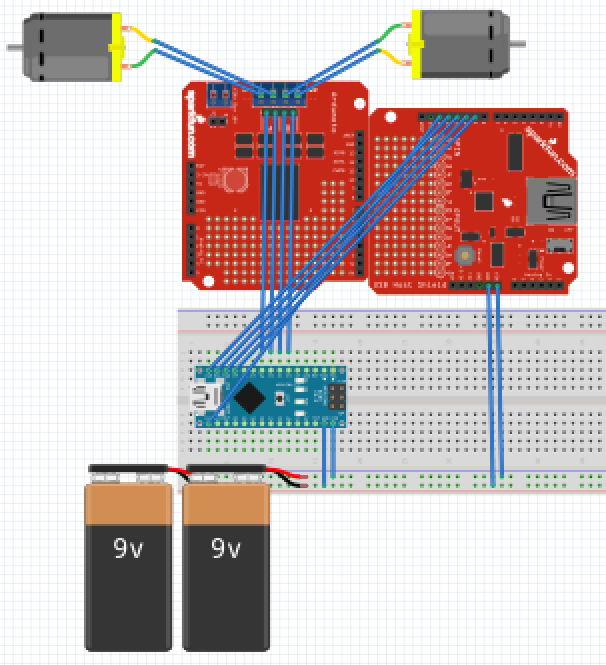
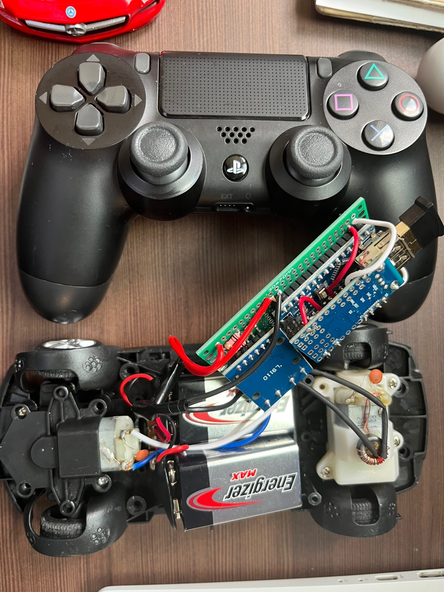

# arduino dualshock for RC car

## Blueprint

It's a very brief blueprint. Switch, resistance, usb dongle, etc. were omitted, and usb host shield and motor driver were smaller than the design drawing. The pin number may also be different from the actual one.

`PIN9 == INT, PIN10 == SS, PIN11 == MOSI, PIN12 == MISO, PIN13 == SCK`

## Photo

## Video
Testing on breadboard without resistor
  

Testing on PCB with resistor

## Problems and Solutions
1. When usb is not running well
    - Verify that the RST of usb is connected to the VCC together. [Reference](https://ht-deko.com/arduino/shield_usbhost_mini.html)
    - You didn't have to cut the 5 volt cable
    - Make sure that the pins are connected correctly. Depending on the USB host shield product, MISO, MOSI, and CLK may be printed incorrectly.
2. The motor driver works well when two motors are operated, but only one is not operated
    - Set the motor voltage on the off side to HIGH-HIGH instead of LOW-LOW
3. When the Bluetooth connection disconnects often,
    - Presumably due to too low current flow in usb
    - Provide appropriate current to usb
    - By inserting a resistor, the amount of current flowing through the Arduino can be increased and the Bluetooth can be prevented from breaking. However, the current flowing through the motor decreases, reducing the output of the motor.

## Reference
https://maker.pro/arduino/projects/how-to-control-an-arduino-robot-with-a-ps4-bluetooth-controller  
https://github.com/felis/USB_Host_Shield_2.0/blob/master/examples/Bluetooth/PS4BT/PS4BT.ino  
https://comocloud.tistory.com/207#recentComments  
https://ht-deko.com/arduino/shield_usbhost_mini.html